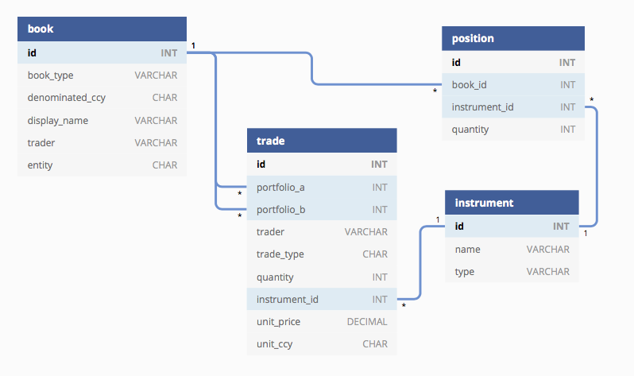
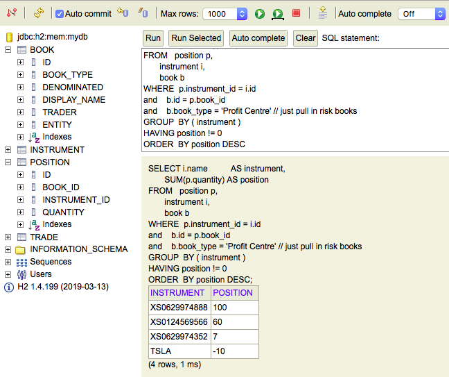

# Overview 
This article presents a relational database schema for a trading application and examines what happens when a trade is executed, including how to handle fx conversion of monetary amounts and trade history via bi-temporal chaining. We look at some typical trade reporting use cases and associated sql queries, and show a simple way to run and test queries locally using an embedded [H2](https://www.h2database.com/html/main.html) in-memory database. 
    
In the final section we discuss some of the different ways to access the database model within a Java application before choosing the 'ORM-alternative' database library [jOOQ](https://www.jooq.org) with a demo using a simple Spring Boot application. 


# Domain Model
From the previous article, we defined three key parts to the domain:
* _Book_ - represent the parties/accounts involved in a trade, and is essentially a collection of positions
* _Trade_ - modifies positions in two books
* _Position_ - total holding of a particular type of instrument in a book

We should add to that an _Instrument_ which is the thing been traded 


# Schema 
Lets define the minimal schema to demonstrate what happens when a trade is booked.

The `book` table will have a type (e.g. trading book with a profit centre versus customer book), denominated currency, name of trader (likely the desk head in charge, can be null if its a customer book), and legal entity - a distinct ring-fenced part of the business often based on geography with different entities for US , EMEA and APAC but may be broken down further. Once set up, this data wont generally change that often.
```sql
CREATE TABLE book (
  id INT AUTO_INCREMENT  PRIMARY KEY,
  book_type VARCHAR(20) NOT NULL,
  denominated CHAR(3) NOT NULL,
  display_name VARCHAR(50) NOT NULL,
  trader VARCHAR(50) NULL,
  entity CHAR(4) NOT NULL
  ...
);
```

An `instrument` is the thing been traded, it has a human readable name together with industry standard identifiers (e.g. ISIN, SEDOL), plus a bunch of attributes that will be used for pricing purposes. 
```sql
CREATE TABLE instrument (
  id INT AUTO_INCREMENT  PRIMARY KEY,
  name VARCHAR(100) NOT NULL,
  type VARCHAR(100) NOT NULL
  ...
);
```

The `trade` table records the two parties involved in the trade via a reference to the trading and client book (we've called them `book_a`  and `book_a`) and the trader, the direction of the trade - whether it was a buy (`B`) or sell (`S`), the quantity traded, and the details on the instrument including its price and base currency. We've not shown it here, but settlement details will also be linked to the trade.
```sql
CREATE TABLE trade (
  id INT AUTO_INCREMENT  PRIMARY KEY,
  book_a INT NOT NULL,
  book_b INT NOT NULL,
  trader VARCHAR(100) NOT NULL,
  trade_type CHAR(1) NOT NULL,  
  quantity INT NOT NULL,
  instrument_id  INT NOT NULL,
  unit_price DECIMAL(10,5),
  unit_ccy CHAR(3) NOT NULL,
  FOREIGN KEY (book_a) REFERENCES book(id),
  FOREIGN KEY (book_b) REFERENCES book(id),
  FOREIGN KEY (instrument_id) REFERENCES instrument(id)
);
```
(other possible names for this table - `order` or `transaction`?)

A little trick can be used when inserting data into the `trade` table -  if (party for) book a is selling then `quantity` is negative, otherwise positive - this avoids having _case_ like statements in your sql but requires any business logic (in sql, source code, or elsewhere) to be aware of this convention.    


The position table holds the _total_ holdings of an instrument in a book at a particular point in time. It could be tempting to use the trade table to derive the same aggregate view of the open position quantity, in practice its a bit more efficient to store position separately and avoid the trade table queries (even with well thought out indexes). Bear in mind this introduces the risk the trade and position tables don't match if an edit is done in one table but not the other. It should, however, always be possible to regenerate the position table from the trade table.      
```sql
CREATE TABLE position (
  book_id INT NOT NULL,
  instrument_id  INT NOT NULL,
  quantity INT NOT NULL,
  FOREIGN KEY (book_id) REFERENCES book(id),
  FOREIGN KEY (instrument_id) REFERENCES instrument(id)
);
```
(a composite primary key made up of `book_id` and `instrument_id` has been chosen for this table)

This in the final schema and relationships:



(created using [dbdiagram.io](https://dbdiagram.io/d/5e8e42443d30f00839b3b7f9))
 
# What happens when a trade is booked?

Lets continue the example from the first article where we had this trade:
```
{ "tradeDetails": {
  "book_a": "US Eq Flow", 
  "book_b": "Third Rock",
  "trader": "Sammy Bruce",
  "tradeType": "Sell",
  "quantity": 10
  "quantityUnit": "TSLA"
  "unitPrice": 540.10
  "unitCurrency": "USD"
  ...
}}
```  
Lets assume ops have set up our books and the product team have set up the TSLA security (our entity is made up, the denomination is USD so it would probably be a US business line)

`select * from book where entity where DISPLAY_NAME in ('US Eq Flow', 'Third Rock')`

|ID |BOOK_TYPE  	|DENOMINATED  	|DISPLAY_NAME  	        |TRADER  	 |ENTITY  |
|---|---------------|---------------|-----------------------|------------|--------|
|5	|Profit Centre	|USD	        |US Eq Flow	            |Sammy Bruce |USTRD   |
|6	|Client Book	|USD	        |Third Rock	            |null	     |USTRD   |

(make a mental note of IDs here as used in upcoming sql)

`select * from instrument where NAME = 'TSLA'`

|ID|NAME|
|---|---|
|8  |TSLA|  

 (yes, light on detail, this is all we need for the example)

From this trade we'd expect one new row to be inserted into the `trade` table as per the above trade details
sql (book id's are from the book table):
```sql
INSERT INTO trade (book_a, book_b, trader, trade_type, quantity, instrument_id, unit_price, unit_ccy) VALUES
  (5, 6, 'Sammy Bruce', 'B', -10, 8, 540.10, 'USD')
``` 
(its a sell so we use that trick and make quantity -ve)

A trade modifies positions in two books, one book goes up by the quantity bought/sold, the other down by the same amount - the net effect across both books should always be zero. We'd expect the following increments (decrements) on the `position` table for the trade: 
```
Book Name: US Eq Flow
Quantity: -10
Instrument: TSLA
```
```
Book Name: Third Rock
Quantity: 10
Instrument: TSLA
```  
  
sql: 
```sql
update position 
set quantity      = quantity - 10 
where book_id     = 5 // risk book 
and instrument_id = 8 // TSLA
```
```sql
update position 
set quantity      = quantity + 10 
where book_id     = 6 // client book 
and instrument_id = 8 // TSLA
```
What just happened? Running the above update query blew away what our position was previously, we can no longer go back in time, which is a big problem given the many use cases in a trading and risk system that require data as-of a given business date. How do we fix this? The next section explains ...   

## A note on dates
You'll notice for simplicity none of the tables contain dates - in reality, they will, and its worth commenting on _bi-temporal chaining_ whereby all changes to a database are tracked along two dimensions:
* Business Time - when the change actually occurred in the world
* Processing Time - when the change actually was recorded in the database

This is a common requirement for end-of-day reporting and useful for support analysis.

Its implemented through the addition of four columns:

* `FROM_Z` and `THRU_Z` to track the validity of the row along the business-time dimension
*  `IN_Z` and`OUT_Z` to track the validity of the row along the processing-time dimension

Coming back to the position example, lets look at how to increment position by 10 on client book whilst maintaining history - assume we start with a position of 100 for given book/instrument:  

|BOOK_ID  |INSTRUMENT_ID  |QUANTITY   |FROM_Z|THRU_Z  |IN_Z  |OUT_Z   |
|--------|------|--------|------|--------|------|--------|
|6|5|100|Apr 20|Infinity|Apr 20|Infinity|

`IN_Z` is Apr 20 which tells us trade executed was on this date, `OUT_Z` is 'Infinity' which tells us this row is latest state of the position; Infinity is saying it's an open record, there's no 'to' date, ot can be represented in the database table through the use of a 'magic date' (e.g. year might be set to 9999).  

First invalidate (aka 'chain out') the old row by setting `OUT_Z` to the current business date (pretend today is Apr 23): 

|BOOK_ID  |INSTRUMENT_ID  |QUANTITY   |FROM_Z|THRU_Z  |IN_Z  |OUT_Z   |
|--------|------|--------|------|--------|------|--------|
|6|5|100|Apr 20|Infinity|Apr 20|Apr 23|

Next insert two new rows to indicate:
* From Apr 20 to Apr 23, position = 100 
* From Apr 23 to Infinity, position = 110 (previous position + 10)
  
|BOOK_ID  |INSTRUMENT_ID  |QUANTITY   |FROM_Z|THRU_Z  |IN_Z  |OUT_Z   |
|--------|------|--------|------|--------|------|--------|
|6|5|100|Apr 20|Apr 23|Apr 23|Infinity|
|6|5|110|Apr 23|Infinity|Apr 23|Infinity|
 
To get the _current_ position (i.e `OUT_Z=Infinity`) as-of current business date: 
```sql
select * from position 
where book_id = 6
and instrument_id = 5 
and FROM_Z <= '2020-04-23 00:00:00.000' 
and THRU_Z > '2020-04-23 00:00:00.000' 
and OUT_Z = '9999-12-01 23:59:00.000'
```
To get position as-of a point in the past, lets say the day before before the increment came in (Apr 22): 
```sql
select * from position 
where book_id = 6
and instrument_id = 5 
and FROM_Z <= '2020-04-22 00:00:00.000' 
and THRU_Z > '2020-04-22 00:00:00.000'
and IN_Z <= '2020-04-22 00:00:00.000' 
and OUT_Z > '2020-04-22 00:00:00.000'
```

Check out this very good [goldmansachs](https://goldmansachs.github.io/reladomo-kata/reladomo-tour-docs/tour-guide.html#N408B5) tutorial for more details (including how `THRU_Z` is used to capture same business day changes).   

## A note on currencies
We're dealing with monetary amounts in the `trade.unit_price` field with a currency defined in `trade.unit_ccy`. As such, we need to be very careful not to blindly sum up values that either directly or indirectly reference `unit_price` - it makes no sense adding 100 USD and 50 GBP to get to 150 what? If we need to aggregate values that reference `unit_price` then everything will need converting to the _same_ currency through the use of an _fx rate_ and a bit of simple fx conversion logic. 

What fx rate to use? The currency we're converting _from_ is known (`trade.unit_ccy`), but what currency do we convert _to_? The one defined on the `book.denomicated` (currency) is a good indicator of what numbers should be reported in, although it should be easy to specify a target currency and do the conversion on-the-fly.

A rate would be loaded for given business date/time and given currency pair, and may have been sourced from an external market data provider or contributed internally, perhaps by the fx desk.
  
In the proceeding examples for simplicity we dont apply fx conversion (and we get away with since all trades are in USD)

# Sample queries
In all cases book_a is trader book and book_b is client book

## Find the current position of the firm 
Determine how _long_ and _short_ the firm is on each of the securities it trades - a long position means instrument has been bought and is owned, short on the other hand means the instrument has not been bought yet and is owed to a another party. The `position` table makes this simple with a join on the `trade` table to only select firm side positions associated with a risk book: 
 ```
SELECT i.name          AS instrument, 
       SUM(p.quantity) AS position 
FROM   position p, 
       instrument i, 
       book b
WHERE  p.instrument_id = i.id     
and    b.id = p.book_id
and    b.book_type = 'Profit Centre' // just pull in risk books
GROUP  BY ( instrument ) 
HAVING position != 0
ORDER  BY position DESC  
```
Note we group across book/instrument, summing up the quantities to get overall per instrument rather than breakout by book, and we chose to filter out flat (zero) positions

```
|INSTRUMENT   |POSITION|
|-------------|--------|  
|TSLA	      |300     |
|XS0629974888 |100     |
|XS0124569566 |60      |
|XS0629974352 |7       |
```
## Find the ten securities to which the firm has the greatest exposure (either long or short)
_Exposure_ is a general term that can refer to the total market value of a position, the total amount of possible risk at any given point, or the portion of a fund invested in a particular market or asset.

We'll consider _financial exposure_ which is limited to the amount spent on opening a position – e.g. the most that can be lost from buying shares is the amount paid for them in the 1st place - and we capture this in the `trade.unit_price`

Most of what we need here is in the `trade` table with a join on `instrument` to get a human readable name: 
 
```
SELECT TOP 10 i.name                         AS instrument, 
       SUM(t.quantity * t.unit_price)        AS exposure 
FROM   trade t, 
       instrument i 
WHERE  t.instrument_id = i.id 
GROUP  BY ( i.name ) 
ORDER  BY ABS(SUM(t.quantity * t.unit_price)) DESC  
```
Note use of absolute (`ABS`) function to pull in top 10 regardless of the sign. 

```
|INSTRUMENT   |EXPOSURE     |
|-------------|-------------|  
|TSLA         |159997.00000 |
|XS0629974888 |100310.63940 |
|XS0124569566 |1946.82000   |
|XS0629974352 |700.71500    |
|XS0104440986 |-238.95000   |
```
## Find the trader with the highest aggregate exposure among their top five securities.
This is a non trivial query that makes use of [ROW_NUMBER](https://www.sqltutorial.org/sql-window-functions/sql-row_number/) and [PARTITION](https://www.sqltutorial.org/sql-window-functions/sql-partition-by/): to find the nth highest value per group
 
* the `PARTITION BY` clause distributes the trades by (trading) book
* the `ORDER BY` clause sorts the trades in each book by exposure
* the `ROW_NUMBER()` assigns each row a sequential integer number, it resets the number when the book changes

```
SELECT TOP 1 b.trader, 
       SUM(aggregate.exposure) AS exposure 
FROM   (SELECT book_a                                   AS trader, 
               instrument_id, 
               SUM(quantity * unit_price)                    AS exposure, 
               ROW_NUMBER() 
                 OVER( 
                   PARTITION BY book_a 
                   ORDER BY SUM(quantity * unit_price) DESC) AS rank 
        FROM   trade 
        GROUP  BY book_a, 
                  instrument_id 
        ORDER  BY trader, 
                  rank) aggregate, 
       book b 
WHERE  aggregate.rank <= 5 // top 5 securities
AND    b.id = aggregate.trader 
GROUP  BY aggregate.trader 
ORDER  BY exposure DESC 
``` 
```
|TRADER      |EXPOSURE     |
|------------|-------------|  
|Sammy Bruce |159997.00000 |
```
Note we've taken _trader_ to refer to the desk head associated with a book rather than the one involved in a single deal (and recorded on the `trade` table).

# Using embedded H2 database inside browser to run sql queries
A simple [Spring Boot](https://spring.io/projects/spring-boot) app using an embedded in memory [H2 database](https://www.h2database.com/html/main.html) created to test the schema and queries (based on this great [baeldung tutorial](https://www.baeldung.com/spring-boot-h2-database))

To use, check out [tradebook](https://github.com/stehrn/tradebook) GitHub repo and: 

   * Run [SpringBootH2Application](src/main/java/com/stehnik/tradebook/SpringBootH2Application.java) 
   * Go to http://localhost:8080/h2-console (check _JDBC URL_ is `jdbc:h2:mem:mydb`, and password intentionally left blank)

You should see something like this:



You can run any of the sql defined above in the browser.

# Accessing the database model within a Java application
So how to make use of the relational model we've defined so far within a Java application? 

[JDBC](https://docs.oracle.com/javase/tutorial/jdbc/basics/index.html) is an option, it could be used to execute the hand crafted sql defined in the previous section, but there'd be a lot of boilerplate code to write first - code to access the database and transform results to/from a reasonable Java representation. For many engineers (working diligently through the [Java Tutorial](https://docs.oracle.com/javase/tutorial/jdbc/basics/index.html)) its their first taste of connecting to a database via Java, and for simple projects it may well suffice.  
   
A better alternative is to use a Java database library that can auto-generate code from an _existing_ database and provide a API to build type-safe SQL queries - this means compile time checks and avoidance of runtime errors linked to incorrect data type conversion. They also provide better database portability since potentially database vendor specific sql wont be embedded inside the Java code.

Object relational Mapping (ORM) turns things around, instead of the relational data model driving the application design, the application design drives the data model(s). Start with the Java object design and use an ORM to map the object model to a relational data model, the diagram shows the object model on the left, database tables and rows on the right, and arrows to indicate the work the ORM needs to do to bind the two together. 


(source [Martin Fowler](https://martinfowler.com/bliki/OrmHate.html))

ORMs are great if you want to focus on your Java object model and avoid getting near anything that looks like sql; Martin Fowler provides a [good critique](https://martinfowler.com/bliki/OrmHate.html) of ORMs and points towards a non-relational database alternative - noSQL. noSQL, as the name implies, has no schema as such, for our trading application we'd probably store some sort of json representation of trades and positions like we saw in the first article: 

```
{ "book": "US Eq Flow", "instrument": "TSLA", "quantity": 290, "price": 156,950 
  "trades" [
     { "id:" 8, "quantity": -10, "counterparty": "Third Rock Investments"},
     { "id:" 7, "quantity": 200, "counterparty": "Blue Sky"},
     { "id:" 6, "quantity": 50, "counterparty": "Third Rock Investments"},
     { "id:" 5, "quantity": -50, "counterparty": "Third Rock Investments"},
     { "id:" 4, "quantity": 100, "counterparty": "Third Rock Investments"},
  ]
}
```   
Having no rigid schema can help with data and applications that are evolving - its easier to add something to a json message compared to adding a new column to a database table - e.g. we might decide to track settlement in the trade, to do so we just add this to any new json entries (note how old entries remain the same): 
```
{ "book": "US Eq Flow", "instrument": "TSLA", "quantity": 290, "price": 156,950 
  "trades" [
      ... 
     { "id:" 8, "quantity": -10, "counterparty": "Third Rock Investments"},
     { "id:" 9, "quantity": -10, "counterparty": "Third Rock Investments", "settlement": "T+2"}
```
noSQL databases are also easy to scale horizontally, often run as a distributed cluster providing resilience - the cost here is giving up the 'C' of ACID (Consistency) and relying instead on _eventual_ consistency. You'd have to think hard about using noSQL for a trading application that can have complex reporting queries and high transaction rates, whilst not adhering to ACID properties could mean losing real money. There are techniques to handle some of these issues and noSQL is still worth serious consideration.  

Since our trading app already has a database model lets choose the 'ORM-alternative' database library [jOOQ Object Oriented Querying (jOOQ)](https://www.jooq.org), its tag-line sums it up - "the easiest way to write SQL in Java". The maven project [pom](pom.xml) contains a profile to auto-generate Java source - it  points to the schema file and the package name and directory for the generated source to be written to; to generate run:
```
mvn generate-sources -P jooq
```
This will create a bit of framework code, Data Access Objects (DAOs), and simple POJOs for book, instrument, trade, and position e.g.:
```java
/**
 * This class is generated by jOOQ.
 */
@Generated(
    value = {
        "http://www.jooq.org",
        "jOOQ version:3.11.11"
    },
    comments = "This class is generated by jOOQ"
)
@SuppressWarnings({ "all", "unchecked", "rawtypes" })
public class Book implements Serializable {

    private static final long serialVersionUID = 1793092507;

    private Integer id;
    private String  bookType;
    private String  denominated;
    private String  displayName;
    private String  trader;
    private String  entity;

...
```
Wiring jOOQ into Spring Boot is easy (see [Spring Boot documentation](https://docs.spring.io/spring-boot/docs/current/reference/html/spring-boot-features.html#boot-features-jooq)), a very basic demo app (really just a spike), has been written illustrate this for the trade database, to see it in action go to `http://localhost:8080/listPositions`, which is running this code (see [TradebookController](src/main/java/com/stehnik/tradebook/TradebookController.java) positions()):

```java
Configuration jooqConfiguration = <autowired by Spring Boot>
PositionDao positionDao = new PositionDao(jooqConfiguration);
List<Position> positions = positionDao.findAll();
```
..which will return :
```
[
  {"bookId":5, "instrumentId":8, "quantity":300},
  {"bookId":6, "instrumentId":8, "quantity":-50},
  {"bookId":4, "instrumentId":8, "quantity":-200},
  ...
]
```
A slightly more complex example returns all the trades for a given position, e.g. to show trades for 'US Eq Flow' risk book and 'TSLA' security:
 
`http://localhost:8080/tradesForPosition?book=US%20Eq%20Flow&security=TSLA`

The presentation is not pretty but you'll see (trade quantity, trade ID, counterparty/customer book):
```java
[
  [100,4,"Third Rock"],
  [-50,5,"Third Rock"],
  [50,6,"Third Rock"],
  [200,7,"Blue Sky"]
]
```
The Java code to return this (see [TradebookController](src/main/java/com/stehnik/tradebook/TradebookController.java) tradesForPosition()) is below, and shows it really is like "writing SQL in Java":  
```java
...
return dsl.select()
       .from(TRADE)
       .join(trade_book).on(TRADE.BOOK_A.eq(trade_book.ID))
       .join(client_book).on(TRADE.BOOK_B.eq(client_book.ID))
       .join(INSTRUMENT).on(TRADE.INSTRUMENT_ID.eq(INSTRUMENT.ID))
       .where(trade_book.DISPLAY_NAME.eq(book))
       .and(INSTRUMENT.NAME.eq(security))
       .fetch()
       .into(trade_book.DISPLAY_NAME, INSTRUMENT.NAME, TRADE.QUANTITY, TRADE.ID, client_book.DISPLAY_NAME)
       .intoArrays();
```  

# Recap
We've covered the domain model and schema for a simple trade application and some example sql for some common use cases. In many cases teams wont want to hand craft sql but rather delegate things to an ORM or ORM-alternative (or both). An ORM-alternative like jOOQ lets developers stay closer to the sql and relational model (even though they use Java to write it), some may want a bit more out of their Java library, to get a bit more for free and have a bit more abstraction so as not to have to literally replicate the sql query directly in Java code - this abstraction is what an ORM provides. Its worth noting an understanding of the underlying sql will certainly help when looking into bugs or dealing with support or non-functional issues such as slow performance. 

The demo app has scope to be extended, and [Spring JPA](https://spring.io/guides/gs/accessing-data-jpa/) is worth a look, particularly since its based on the Java persistence API - a specification for accessing relational data and mapping to objects (i.e. an ORM). ORMs got only a brief mention above, so the next article will look at extending the Spring boot app to use an ORM and considers a noSQL based approach.   

Thanks for reading!


  
