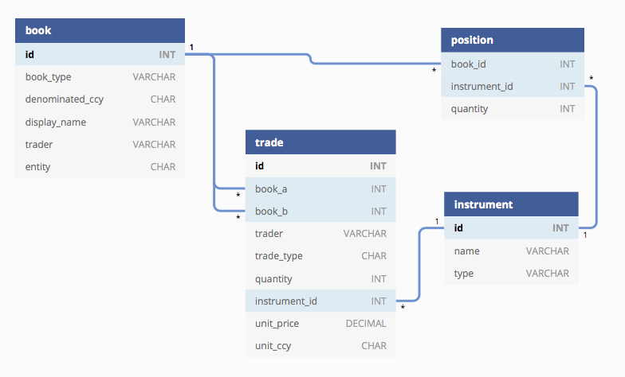

# Overview 
This article will look at the relational database schema for a trading application and some example queries that could be run for different use cases. A simple way to run and test queries locally using an embedded in-memory database is presented, and we finish with a quick look at alternatives to hand crafted sql through the use of Object Relational Mapping (ORM).    

# Domain Model
From the previous article, we defined three key parts to the domain:
* _Book_ - represent the parties/accounts involved in a trade, and is essentially a collection of positions
* _Trade_ - modifies positions in two books
* _Position_ - total holding of a particular type of instrument in a book

We should add to that an _Instrument_ which is the thing been traded 


# Schema 
Lets define the minimal schema to demonstrate what happens when a trade is booked.

The `book` table will have a type (e.g. trading book with a profit centre versus customer book), denominated currency, name of trader (likely the desk head in charge, can be null if its a customer book), and legal entity - a distinct ring-fenced part of the business often based on geography with different entities for US , EMEA and APAC but may be broken down further. Once set up, this data wont generally change that often.
```sql
CREATE TABLE book (
  id INT AUTO_INCREMENT  PRIMARY KEY,
  book_type VARCHAR(20) NOT NULL,
  denominated CHAR(3) NOT NULL,
  display_name VARCHAR(50) NOT NULL,
  trader VARCHAR(50) NULL,
  entity CHAR(4) NOT NULL
  ...
);
```

An `instrument` is the thing been traded, it has a human readable name together with industry standard identifiers (e.g. ISIN, SEDOL), plus a bunch of attributes that will be used for pricing purposes; there will also be 
```sql
CREATE TABLE instrument (
  id INT AUTO_INCREMENT  PRIMARY KEY,
  name VARCHAR(100) NOT NULL,
  type VARCHAR(100) NOT NULL
  ...
);
```

The `trade` table records the two parties involved in the trade via a reference to the trading and client book (we've called them `portfolio_a`  and `portfolio_a`) and the trader, the direction of the trade - whether it was a buy (`B`) or sell (`S`), the quantity traded, and the details on the instrument including its price and base currency. We've not shown it here, but settlement details will also be linked to the trade.
```sql
CREATE TABLE trade (
  id INT AUTO_INCREMENT  PRIMARY KEY,
  portfolio_a INT NOT NULL,
  portfolio_b INT NOT NULL,
  trader VARCHAR(100) NOT NULL,
  trade_type CHAR(1) NOT NULL,  
  quantity INT NOT NULL,
  instrument_id  INT NOT NULL,
  unit_price DECIMAL(10,5),
  unit_ccy CHAR(3) NOT NULL,
  FOREIGN KEY (portfolio_a) REFERENCES book(id),
  FOREIGN KEY (portfolio_b) REFERENCES book(id),
  FOREIGN KEY (instrument_id) REFERENCES instrument(id)
);
```
(other possible names for this table - `order` or `transaction`?)

A little trick can be used when inserting data into the `trade` table -  if its a sell the `quantity` is negative, otherwise positive - this avoids having _case_ like statements in your sql but requires any business logic (in sql, source code, or elsewhere) to be aware of this convention.    

The position table holds the _total_ holdings of an instrument in a book at a particular point in time. It could be tempting to use the trade table to derive the same aggregate view of the open position quantity, in practice its a bit more efficient to store position separately and avoid the trade table queries (even with well thought out indexes). Bear in mind this introduces the risk the trade and position tables don't match if an edit is done in one table but not the other. It should, however, always be possible to regenerate the position table from the trade table.      
```sql
CREATE TABLE position (
  book_id INT NOT NULL,
  instrument_id  INT NOT NULL,
  quantity INT NOT NULL,
  FOREIGN KEY (book_id) REFERENCES book(id),
  FOREIGN KEY (instrument_id) REFERENCES instrument(id)
);
```
(a composite primary key made up of `book_id` and `instrument_id` has been chosen for this table)

This in the final schema and relationships:



(created using [dbdiagram.io](http://dbdiagram.io))
 
# What happens when a trade is booked?

Lets continue the example from the first article where we had this trade:
```
Trade Details {
  Portfolio_a: "US Eq Flow", 
  Portfolio_b: "Third Rock Investments",
  Trader: "Sammy Bruce",
  Trade Type: "Sell",
  Quantity: 10
  Quantity Unit: "TSLA"
  Unit Price: 540.10
  Unit Currency: "USD"
  ...
}
```
Lets assume ops have set up our books and the product team have set up the TSLA security (our entity is made up, the denomination is USD so it would probably be a US business line)

`select * from book where entity where DISPLAY_NAME in ('US Eq Flow', 'Third Rock Investments')`

|ID |BOOK_TYPE  	|DENOMINATED  	|DISPLAY_NAME  	        |TRADER  	 |ENTITY  |
|---|---------------|---------------|-----------------------|------------|--------|
|5	|Profit Centre	|USD	        |US Eq Flow	            |Sammy Bruce |USTRD   |
|6	|Client Book	|USD	        |Third Rock Investments	|null	     |USTRD   |
(make a mental note of IDs here as used in upcoming sql)

`select * from instrument where NAME = 'TSLA'`

|ID|NAME|
|---|---|
|8|TSLA|  
 (yes, light on detail, this is all we need for the example)

From this trade we'd expect one new row to be inserted into the `trade` table as per the above trade details
sql (portfolio id's are from the book table):
```sql
INSERT INTO trade (portfolio_a, portfolio_b, trader, trade_type, quantity, instrument_id, unit_price, unit_ccy) VALUES
  (5, 6, 'Sammy Bruce', 'B', -10, 8, 540.10, 'USD')
``` 
(its a sell so we use that trick and make quantity -ve)

A trade modifies positions in two books, one book goes up by the quantity bought/sold, the other down by the same amount - the net effect across both books should always be zero. We'd expect the following increments (decrements) on the `position` table for the trade: 
```
Book Name: US Eq Flow
Quantity: -10
Instrument: TSLA
```
```
Book Name: Third Rock Investments
Quantity: 10
Instrument: TSLA
```  
  
sql: 
```sql
update position 
set quantity      = quantity - 10 
where book_id     = 5 // risk book 
and instrument_id = 8 // TSLA
```
```sql
update position 
set quantity      = quantity + 10 
where book_id     = 6 // client book 
and instrument_id = 8 // TSLA
```
What just happened? Running the above update query blew away what our position was previously, we can no longer go back in time, which is a big problem given the many use cases in a trading and risk system that require data as-of a given business date. How do we fix this? The next section explains ...   

## A note on dates
You'll notice for simplicity none of the tables contain dates - in reality, they will, and its worth commenting on _bi-temporal chaining_ whereby all changes to a database are tracked along two dimensions:
* Business Time - when the change actually occurred in the world
* Processing Time - when the change actually was recorded in the database

This is a common requirement for end-of-day reporting and useful for support analysis.

Its implemented through the addition of four columns:

* `FROM_Z` and `THRU_Z` to track the validity of the row along the business-time dimension
*  `IN_Z` and`OUT_Z` to track the validity of the row along the processing-time dimension

Coming back to the position example, lets look at how to increment position by 10 on client book whilst maintaining history - assume we start with a position of 100 for given book/instrument:  

|BOOK_ID  |INSTRUMENT_ID  |QUANTITY   |FROM_Z|THRU_Z  |IN_Z  |OUT_Z   |
|--------|------|--------|------|--------|------|--------|
|6|5|100|Apr 20|Infinity|Apr 20|Infinity|

`IN_Z` is Apr 20 which tells us trade executed was on this date, `OUT_Z` is 'Infinity' which tells us this row is latest state of the position; Infinity is saying it's an open record, there's no 'to' date, ot can be represented in the database table through the use of a 'magic date' (e.g. year might be set to 9999).  

First invalidate (aka 'chain out') the old row by setting `OUT_Z` to the current business date (pretend today is Apr 23): 

|BOOK_ID  |INSTRUMENT_ID  |QUANTITY   |FROM_Z|THRU_Z  |IN_Z  |OUT_Z   |
|--------|------|--------|------|--------|------|--------|
|6|5|100|Apr 20|Infinity|Apr 20|Apr 23|

Next insert a new row with previous position + 10, 

|BOOK_ID  |INSTRUMENT_ID  |QUANTITY   |FROM_Z|THRU_Z  |IN_Z  |OUT_Z   |
|--------|------|--------|------|--------|------|--------|
|6|5|110|Apr 23|Infinity|Apr 23|Infinity|

These table entries tell us:
* From Apr 20 to Apr 23, position = 100 
* From Apr 23 to Infinity, position = 110 (previous position + 10)
 
To get the _current_ position (i.e `OUT_Z=Infinity`) as-of current business date: 
```sql
select * from position 
where book_id = 6
and instrument_id = 5 
and FROM_Z <= '2020-04-23 00:00:00.000' 
and THRU_Z > '2020-04-23 00:00:00.000' 
and OUT_Z = '9999-12-01 23:59:00.000'
```
To get position as-of a point in the past, lets say the day before before the increment came in (Apr 22): 
```sql
select * from position 
where book_id = 6
and instrument_id = 5 
and FROM_Z <= '2020-04-22 00:00:00.000' 
and THRU_Z > '2020-04-22 00:00:00.000'
and IN_Z <= '2020-04-22 00:00:00.000' 
and OUT_Z > '2020-04-22 00:00:00.000'
```

Check out this very good [goldmansachs](https://goldmansachs.github.io/reladomo-kata/reladomo-tour-docs/tour-guide.html#N408B5) tutorial for more details (including how `THRU_Z` is used to capture same business day changes).   

## A note on currencies
We're dealing with monetary amounts in the `trade.unit_price` field with a currency defined in `trade.unit_ccy`. As such, we need to be very careful not to blindly sum up values that either directly or indirectly reference `unit_price` - it makes no sense adding 100 USD and 50 GBP to get to 150 what? If we need to aggregate values that reference `unit_price` then everything will need converting to the _same_ currency through the use of an _fx rate_ and a bit of simple fx conversion logic. 

What fx rate to use? The currency we're converting _from_ is known (`trade.unit_ccy`), but what currency do we convert _to_? The one defined on the `book.denomicated` (currency) is a good indicator of what numbers should be reported in, although it should be easy to specify a target currency and do the conversion on-the-fly.

A rate would be loaded for given business date/time and given currency pair, and may have been sourced from an external market data provider or contributed internally, perhaps by the fx desk.
  
In the proceeding examples for simplicity we dont apply fx conversion (and we get away with since all trades are in USD)

# Sample queries
In all cases portfolio_a is trader book and portfolio_b is client book

## Find the current position of the firm 
Determine how long and short the firm is on each of the securities it trades - the `position` table makes this simple with a join on the `trade` table to only select firm side positions associated with a risk book: 
 ```
SELECT i.name          AS instrument, 
       SUM(p.quantity) AS position 
FROM   position p, 
       instrument i, 
       book b
WHERE  p.instrument_id = i.id     
and    b.id = p.book_id
and    b.book_type = 'Profit Centre' // just pull in risk books
GROUP  BY ( instrument ) 
HAVING position != 0
ORDER  BY position DESC  
```
Note we group across book/instrument, summing up the quantities to get overall per instrument rather than breakout by book, and we chose to filter out flat (zero) positions

## Find the ten securities to which the firm has the greatest exposure (either long or short)
_Exposure_ is a general term that can refer to the total market value of a position, the total amount of possible risk at any given point, or the portion of a fund invested in a particular market or asset.

We'll consider _financial exposure_ which is limited to the amount spent on opening a position – e.g. the most that can be lost from buying shares is the amount paid for them in the 1st place - and we capture this in the `trade.unit_price`

Most of what we need here is in the `trade` table with a join on `instrument` to get a human readable name: 
 
```
SELECT TOP 10 i.name                         AS instrument, 
       SUM(t.quantity * t.unit_price)        AS exposure 
FROM   trade t, 
       instrument i 
WHERE  t.instrument_id = i.id 
GROUP  BY ( i.name ) 
ORDER  BY ABS(SUM(t.quantity * t.unit_price)) DESC  
```
Note use of absolute (`ABS`) function to pull in top 10 regardless of the sign. 

## Query those tables to find the trader with the highest aggregate exposure among their top five securities.
This is a non trivial query that makes use of [ROW_NUMBER](https://www.sqltutorial.org/sql-window-functions/sql-row_number/) and [PARTITION](https://www.sqltutorial.org/sql-window-functions/sql-partition-by/): to find the nth highest value per group
 
* the `PARTITION BY` clause distributes the trades by (trading) portfolio
* the `ORDER BY` clause sorts the trades in each portfolio by exposure
* the `ROW_NUMBER()` assigns each row a sequential integer number, it resets the number when the portfolio changes

```
SELECT TOP 1 b.trader, 
       SUM(aggregate.exposure) AS exposure 
FROM   (SELECT portfolio_a                                   AS trader, 
               instrument_id, 
               SUM(quantity * unit_price)                    AS exposure, 
               ROW_NUMBER() 
                 OVER( 
                   PARTITION BY portfolio_a 
                   ORDER BY SUM(quantity * unit_price) DESC) AS rank 
        FROM   trade 
        GROUP  BY portfolio_a, 
                  instrument_id 
        ORDER  BY trader, 
                  rank) aggregate, 
       book b 
WHERE  aggregate.rank <= 5 // top 5 securities
AND    b.id = aggregate.trader 
GROUP  BY aggregate.trader 
ORDER  BY exposure DESC 
``` 
Note we've taken _trader_ to refer to the desk head associated with a book rather than the one involved in a single deal (and recorded on the `trade` table).

# Using embedded H2 database inside browser to run sql queries
A simple [Spring Boot](https://spring.io/projects/spring-boot) app using an embedded in memory [H2 database](https://www.h2database.com/html/main.html) created to test the schema and queries (based on this great [baeldung tutorial](https://www.baeldung.com/spring-boot-h2-database))

To use, check out [tradebook](https://github.com/stehrn/tradebook) GitHub repo and: 

   * Run [SpringBootH2Application](src/main/java/com/stehnik/tradebook/SpringBootH2Application.java) 
   * Go to http://localhost:8080/h2-console (check _JDBC URL_ is `jdbc:h2:mem:mydb`, and password intentionally left blank)

You should see something like this:


You can run any of the sql defined above in the browser.

# Adding a Java ORM layer
So how do we use what we've looked at so far in a Java application? We started with a database schema and  could use [JDBC](https://docs.oracle.com/javase/tutorial/jdbc/basics/index.html) to execute sql, and this may be fine for some teams who have decent sql experience and are happy with the tight coupling to the persistence layer.  

Many teams try and avoid hand crafting and maintaining sql queries for specific database vendors, relying instead on Object Relational Mapping (ORM). This lets us deal in Java objects (typically POJOs), database specifics are abstracted away, and different data providers can be plugged in with a bit of configuration, no sql needs to be written.   
 
There are lots of ORM libraries out there, we'll look at [jOOQ Object Oriented Querying (jooq)](https://www.jooq.org) which generates Java objects from an existing table schema and will let us build type-safe SQL queries through a fluent API.
 
ORMs let you do it the other way round as well - if you have a set of Java objects with relevant annotations a database schema can be auto-generated.    
 
The maven project [pom](pom.xml) contains a profile to auto-generate Java source using jooq - it  points to the schema file and the package name and directory for the generated source to be written to. To create source run:
```
mvn generate-sources -P jooq
```
This will create a bit of framework code, Data Access Objects (DAOs), and simple POJOs for book, instrument, trade, and position e.g.:
```java
/**
 * This class is generated by jOOQ.
 */
@Generated(
    value = {
        "http://www.jooq.org",
        "jOOQ version:3.11.11"
    },
    comments = "This class is generated by jOOQ"
)
@SuppressWarnings({ "all", "unchecked", "rawtypes" })
public class Book implements Serializable {

    private static final long serialVersionUID = 1793092507;

    private Integer id;
    private String  bookType;
    private String  denominated;
    private String  displayName;
    private String  trader;
    private String  entity;

...
```
Wiring jooq into Spring Boot is easy (see [Spring Boot documentation](https://docs.spring.io/spring-boot/docs/current/reference/html/spring-boot-features.html#boot-features-jooq)). 

To see it in use in the demo app, go to `http://localhost:8080/listPositions`, which is running this code:

```java
Configuration jooqConfiguration = <autowired by Spring Boot>
PositionDao positionDao = new PositionDao(jooqConfiguration);
List<Position> positions = positionDao.findAll();
```
(see [TradebookController](src/main/java/com/stehnik/tradebook/TradebookController.java))

# Recap
We've covered the domain model and sql schema for a simple trade application. If we wanted to extend this to pricing then more data would be required (an idea for a future article?). Some important factors such as fx conversion of monetary amounts and bi-temporal chaining to maintain trade history have also been discussed.  

Its worth mentioning one of the alternatives to a relational databases - noSQL. There's no schema as such, which can help with data and applications that are evolving; and its easy to scale horizontally - often run as a distributed cluster - at the cost of giving up the 'C' of ACID (Consistency) and relying instead on _eventual_ consistency. You'd have to think hard about using noSQL for a trading application that can have complex queries and reporting and high transaction rates, where not adhering to ACID properties could mean losing a lot of money.  

In many cases teams wont hand craft sql but rather delegate things to an ORM, although an understanding of the underlying sql will help when looking into bugs or dealing with support or non-functional issues such as slow performance.  

Thanks for reading!